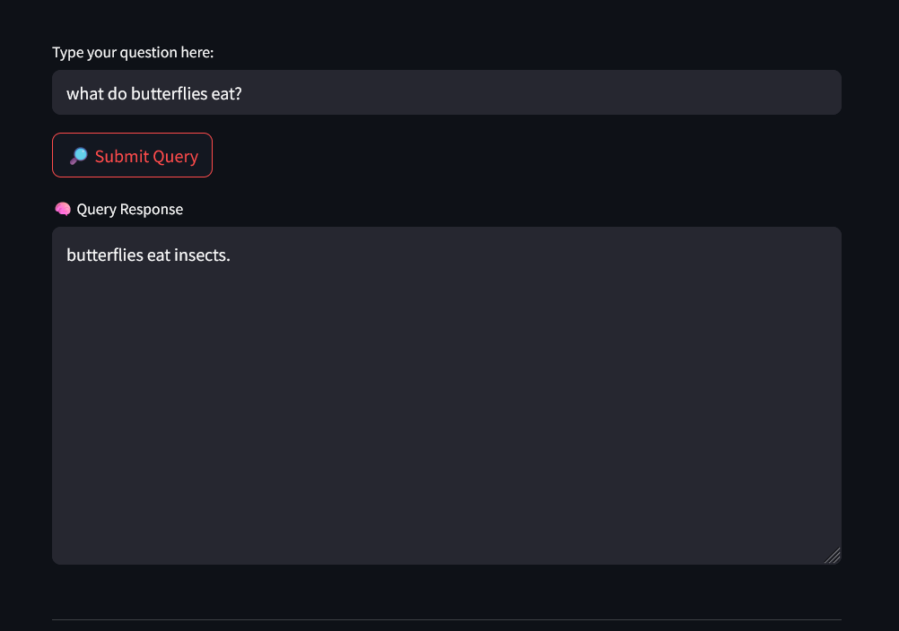

# Document Summarization with Retrieval-Augmented Generation with Q&A Streamlit App

Author: Fatima Tu Zahra

Project Type: NLP / Document Summarization / Streamlit App

Technologies: Python · Streamlit · Chroma · SentenceTransformers · HuggingFace LLMs · LangChain

Features: Summarization · Semantic Search · Q&A from Document Content

## Overview
This project implements a Retrieval-Augmented Generation (RAG) pipeline to summarize long documents and answer user queries based on document content. Users can upload documents (PDF, TXT, Markdown), and the system retrieves contextually relevant chunks to generate a summary or respond to custom questions using a large language model.

Built with modularity and real-world use in mind, the app offers:
- Semantic chunking of text
- Vector-based document retrieval
- LLM-powered summarization
- Interactive Q&A functionality
- A user-friendly Streamlit interface
  

## Folder Structure

For the jupyter notebook version just open `summarizerNotebook.ipynb` from the main directory.
For the streamlit application, navigate to `RAG_application` using

```bash
cd RAG_application
```
```
Document-Summarizer

├── RAG_application             # streamlit application
    ├── main.py                     # Streamlit front-end and main 
    ├── docHandler.py               # parsing and data processing
    ├── storage_and_retrieval.py    # semantic chunking and Vector DB logic
    ├── summarizer.py               # Summary generation logic
    ├── queryProcessor.py           # Query Response building
    └── requirements.txt            
├── sampleRuns                  # contains sample input along with the output obtained
└── summarizerNotebook.ipynb    # jupyter notebook based implementation
```

## Setup Guide

*Note: This setup guide is made keeping Windows 11 in mind. It may or may not work in linux or any other OS without modifications.*

- First clone the directory and create a virtual environment
- 
  ```bash
  git clone https://github.com/fatima-1206/Document-Summarizer.git 
  python -m venv myvenv
  ```
- Activate the virtual environment and install the dependancies from `requirments.txt`
  
  ```bash
  myvenv/Scripts/activate
  pip install -r requirements.txt
  ```

---
  
### Streamlit Application

- To run the streamlit application, navigate to the directory and run the following command:

  ```bash
  cd RAG_applilcation
  streamlit run main.py
  ```
- It should automatically open up in the browser, if it doesn't, open the following URL:

  ```bash
  http://localhost:8501/
  ```
  In case of further issues, look for a similar URL in the terminal.

---

### Jupyter Notebook

If you are on VSCode, you can run the notebook by selecting the appropriate kernel.

To run the notebook via CLI :

- Register the virtual env as a kernel

  ```bash
  python -m ipykernel install --user --name=myvenv
  ```

- Run Jupyter Notebook in your virtual environment:
  
  ```bash
  Jupyter Notebook
  ```
Now your virtual environment should show up as a kernel when you first run the notebook.

---

Note that the first time you run the application, it may take a few minutes to download the models into your machine.


## Usage Guide
- In the path field, copy paste the absolute path of your document and click Load File.


- After the file has uploaded, you can click on the summary button to get a summary generated for your document.
- Scroll down to see the query field. Try writing a simple query and press the submit query button to get the answer from your document!

